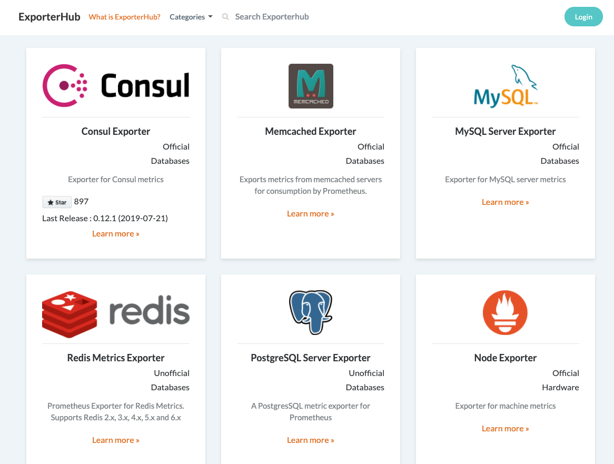

# [Exporterhub.io](https://exporterhub.io/)
> ### A Curated List of Prometheus Exporters 
> #### (powered by [nexclipper](https://nexclipper.io))

## Contents

- [What is ExporterHub.io](https://github.com/NexClipper/exporterhub.io#what-is-exporterhubio)
- [Roadmap](https://github.com/NexClipper/exporterhub.io#roadmap)
- [Official Exporters](https://github.com/NexClipper/exporterhub.io#official-exporters)
- [Exporters](https://github.com/NexClipper/exporterhub.io#exporters)
- [Integration Lists](https://github.com/NexClipper/exporterhub.io#integration-lists)
- [Contribute](https://github.com/NexClipper/exporterhub.io#contribute)
- [References](https://github.com/NexClipper/exporterhub.io#references)
- [License](https://github.com/NexClipper/exporterhub.io#license)

## What is [ExporterHub.io](https://exporterhub.io/)

### ExporterHub.io is a front-end application for the Prometheus Exporters community .

ExporterHub.io is not just a curated list, but also provides exporter installation guide, alert rule configuration, and dashboard configuration.

Each exporter's page contains the followings:

- Official Github (Origin Repository)
- Resource (Install, Exported Metrics)
- Alert-rule (Recommended)
- Dashboard (Grafana)

## Roadmap

To help and ease you with best-practice Prometheus, ExporterHub.io discovers and recommends the best-fit exporter(s) available to expose metrics data from your specific systems and services being monitored.

Using the best-fit exporter(s) helps standardizing metrics data exposition practices, maximizing monitoring experience with minimal manual inputs.

ExporterHub.io recommends the best-fit exporter(s) to support Prometheus monitoring needs in enterprise environments with complex and closed network security settings.

* [x] Installation Guide, Metric Collection Flags, Recommended Alert-rule
* [ ] Card Style Github Page
* [ ] Easy search of Exporters
* [ ] Personalization
* [ ] NexClipper Cloud Integration (coming soon)
  * [ ] Install exporters automatically
  * [ ] Generate Alert Rules
  * [ ] Recommend best-fit exporter(s)

## Official Exporters

[Consul Exporter](https://github.com/NexClipper/exporterhub.io/blob/master/lists/consul/README.md) - Export Consul service health to Prometheus.  
[Memcached Exporter](https://github.com/NexClipper/exporterhub.io/blob/master/lists/memcached/README.md) - Exports metrics from memcached servers for consumption by Prometheus.   
[MySQL Server Exporter](https://github.com/NexClipper/exporterhub.io/blob/master/lists/mysql/README.md) - Exporter for MySQL server metrics   
[Node Exporter](https://github.com/NexClipper/exporterhub.io/blob/master/lists/node/README.md) - Exporter for machine metrics   
[HAProxy Exporter](https://github.com/NexClipper/exporterhub.io/blob/master/lists/haproxy/README.md) - About Simple server that scrapes HAProxy stats and exports them via HTTP   
[CloudWatch Exporter](https://github.com/prometheus/cloudwatch_exporter) - Metrics exporter for Amazon AWS CloudWatch   
[Collectd Exporter](https://github.com/prometheus/collectd_exporter) - A server that accepts collectd stats via HTTP POST and exports them via HTTP   
[Graphite Exporter](https://github.com/prometheus/graphite_exporter) - Server that accepts metrics via the Graphite protocol and exports them   
[InfluxDB Exporter](https://github.com/prometheus/influxdb_exporter) - A server that accepts InfluxDB metrics via the HTTP API and exports them via HTTP  
[JMX Exporter](https://github.com/prometheus/jmx_exporter) - A process for exposing JMX Beans via HTTP for Prometheus consumption   
[SNMP Exporter](https://github.com/prometheus/snmp_exporter) - SNMP Exporter for Prometheus   
[Statsd Exporter](https://github.com/prometheus/statsd_exporter) - StatsD to Prometheus metrics exporter   
[Blackbox Exporter](https://github.com/prometheus/blackbox_exporter) - Blackbox prober exporter   

## Exporters

[Windows Exporter](https://github.com/prometheus-community/windows_exporter) - A Prometheus exporter for Windows machines.    
[JSON Exporter](https://github.com/prometheus-community/json_exporter) - A prometheus exporter which scrapes remote JSON by JSONPath   
[kube-state-metrics](https://github.com/kubernetes/kube-state-metrics) - Add-on agent to generate and expose cluster-level metrics.    
[cAdvisor](https://github.com/google/cadvisor) - Analyzes resource usage and performance characteristics of running containers.   
[Google Stackdriver Exporter](https://github.com/prometheus-community/stackdriver_exporter) - Google Stackdriver Prometheus exporter   
[Redis Metrics Exporter](https://github.com/oliver006/redis_exporter) - Prometheus exporter for Redis metrics.   
[PostgreSQL Server Exporter](https://github.com/wrouesnel/postgres_exporter) - Prometheus exporter for PostgreSQL server metrics.   
[NVIDIA GPU Monitoring Tools](https://github.com/NVIDIA/gpu-monitoring-tools) - NVIDIA GPU Monitoring Tools   
[RabbitMQ Exporter](https://github.com/kbudde/rabbitmq_exporter) - Prometheus exporter for RabbitMQ     
[Ceph Exporter](https://github.com/digitalocean/ceph_exporter) - Prometheus exporter that scrapes meta information about a ceph cluster.
[NGINX Exporter](https://github.com/nginxinc/nginx-prometheus-exporter) - NGINX Prometheus Exporter for NGINX and NGINX Plus   
[Grok Exporter](https://github.com/fstab/grok_exporter) - Export Prometheus metrics from arbitrary unstructured log data.    
[Azure Metrics Exporter](https://github.com/RobustPerception/azure_metrics_exporter) - Azure metrics exporter for Prometheus.   
[eBPF Exporter](https://github.com/cloudflare/ebpf_exporter) - Prometheus exporter for custom eBPF metrics   
[OpenStack Exporter](https://github.com/openstack-exporter/openstack-exporter) - OpenStack Exporter for Prometheus    
[Process Exporter](https://github.com/ncabatoff/process-exporter) - Prometheus exporter that mines /proc to report on selected processes    
[Kong Prometheus Plugin](https://github.com/Kong/kong-plugin-prometheus) - Prometheus plugin for Kong    

## Integration Lists

[Go client library](https://github.com/prometheus/client_golang) - Prometheus instrumentation library for Go applications   
[Prometheus JVM Client](https://github.com/prometheus/client_java) - Prometheus instrumentation library for JVM applications   
[Prometheus Python Client](https://github.com/prometheus/client_python) - Prometheus instrumentation library for Python applications   
[Prometheus Ruby Client](https://github.com/prometheus/client_ruby) - Prometheus instrumentation library for Ruby applications   
[MinIO Server](https://github.com/minio/minio/blob/master/docs/metrics/prometheus/README.md) - How to monitor MinIO server with Prometheus   
[Ansible Tower, AWX](https://docs.ansible.com/ansible-tower/latest/html/administration/metrics.html) - a metrics endpoint in the Ansible Tower API   
[Traefik](https://github.com/containous/traefik) - Provides metrics   
[iapetos](https://github.com/clj-commons/iapetos) - A Clojure Prometheus Client   
[go-metrics](https://github.com/armon/go-metrics) - A Golang library for exporting performance and runtime metrics   
[Micrometer Application Metrics](https://micrometer.io/docs/registry/prometheus) - An application metrics facade for the most popular monitoring tools.   

## Contribute
### Contributions are welcome!   
If you have Specific exporter to contribute to [ExporterHub.io](https://exporterhub.io/), feel free to [send issues](https://github.com/NexClipper/exporterhub.io/issues) or [pull requests](https://github.com/NexClipper/exporterhub.io/pulls).  

## References
- [Official Exporters AND Integrations](https://prometheus.io/docs/instrumenting/exporters/)
- [Awesome Prometheus alerts](https://awesome-prometheus-alerts.grep.to/)
- [SLOs with Prometheus](https://promtools.dev/)
- [Awesome Prometheus](https://github.com/roaldnefs/awesome-prometheus)
- [Promcat](https://promcat.io/)

## License
Exporterhub.io is licensed under the MIT License. See [LICENSE](https://github.com/NexClipper/exporterhub.io/blob/master/LICENSE) for the full license text.