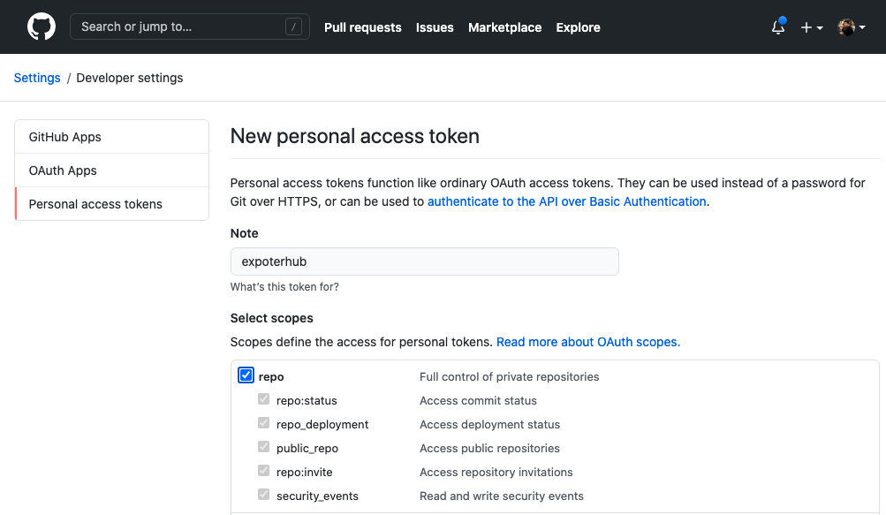

# [Exporterhub.io](https://exporterhub.io/)
> ### A Curated List of Prometheus Exporters 
> #### (powered by [nexclipper](https://nexclipper.io))

## Contents

- [What is ExporterHub.io](https://github.com/NexClipper/exporterhub.io#what-is-exporterhubio)
- [Roadmap](https://github.com/NexClipper/exporterhub.io#roadmap)
- [Architecture diagram](https://github.com/NexClipper/exporterhub.io#architecture-diagram)
- [Contribute](https://github.com/NexClipper/exporterhub.io#contribute)
- [References](https://github.com/NexClipper/exporterhub.io#references)
- [License](https://github.com/NexClipper/exporterhub.io#license)

## What is [ExporterHub.io](https://exporterhub.io/)

### ExporterHub.io is a front-end application for the Prometheus Exporters community .

ExporterHub.io is not just a curated list, but also provides exporter installation guide, alert rule configuration, and dashboard configuration.

Each exporter's page contains the followings:

- Official Github (Origin Repository)
- Resource (Install, Exported Metrics)
- Alert-rule (Recommended)
- Dashboard (Grafana)


## Roadmap

To help and ease you with best-practice Prometheus, ExporterHub.io discovers and recommends the best-fit exporter(s) available to expose metrics data from your specific systems and services being monitored.

Using the best-fit exporter(s) helps standardizing metrics data exposition practices, maximizing monitoring experience with minimal manual inputs.

ExporterHub.io recommends the best-fit exporter(s) to support Prometheus monitoring needs in enterprise environments with complex and closed network security settings.


* [x] Installation Guide, Metric Collection Flags, Recommended Alert-rule
* [ ] Card Style Github Page
* [ ] Easy search of Exporters
* [ ] Personalization
* [ ] NexClipper Cloud Integration (coming soon)
  * [ ] Install exporters automatically
  * [ ] Generate Alert Rules
  * [ ] Recommend best-fit exporter(s)

## Diagram Overview
 * Image click to Youtube:
 * [](https://youtu.be/xLkqm1vEmd0)

## Contribute
Contributions are welcome!   
If you have Specific exporter to contribute to [ExporterHub.io](https://exporterhub.io/), feel free to [send issues](https://github.com/NexClipper/exporterhub.io/issues) or [pull requests](https://github.com/NexClipper/exporterhub.io/pulls).  
### Kickstart
### Token Requires for Github infomation crawling
* ___Create Token 1st before the App runs as below.___
   * https://github.com/settings/tokens/new


* Run the docker-compose as below
```
docker-compose up -d
```


### Manual run
* Start from Docker
```
docker run -d -p 8080:3000 nexclipper/exporterhub:0.1
```
* Check the service normal in CLI or ___You can type exact url in your web browser___
```
curl http://localhost:8080
```

### Details
### Docker image
### Registry
- nexclipper/exporterhub: https://hub.docker.com/repository/docker/nexclipper/exporterhub
- nexclipper/exporterhub-api: https://hub.docker.com/repository/docker/nexclipper/exporterhub-api


### Maintenance
### Tag rule for Build in the hub.docker.com
### exporterhub Frontend build tag
* Source pattern of Tag: `/^fe([0-9.]+)$/` 
   * ex) `fe0.2.0` -> `nexclipper/exporterhub:release-fe0.2.0`
### exporterhub API server build tag
* Source pattern of Tag: `/^api([0-9.]+)$/` 
   * ex) `api0.3` -> `nexclipper/exporterhub-api:release-api0.3`


## References
- [Official Exporters AND Integrations](https://prometheus.io/docs/instrumenting/exporters/)
- [Awesome Prometheus alerts](https://awesome-prometheus-alerts.grep.to/)
- [SLOs with Prometheus](https://promtools.dev/)
- [Awesome Prometheus](https://github.com/roaldnefs/awesome-prometheus)
- [Promcat](https://promcat.io/)


## License
Exporterhub.io is licensed under the MIT License. See [LICENSE](https://github.com/NexClipper/exporterhub.io/blob/master/LICENSE) for the full license text.